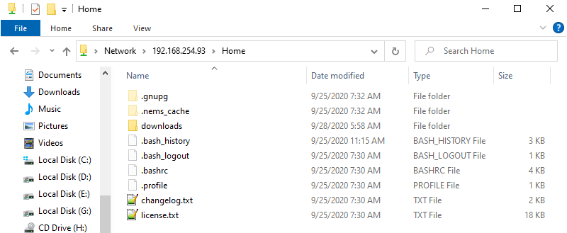
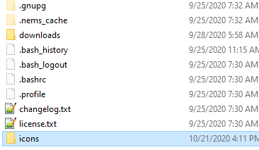
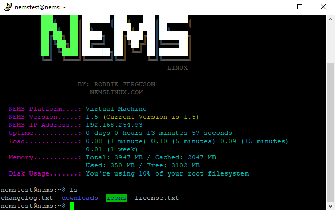
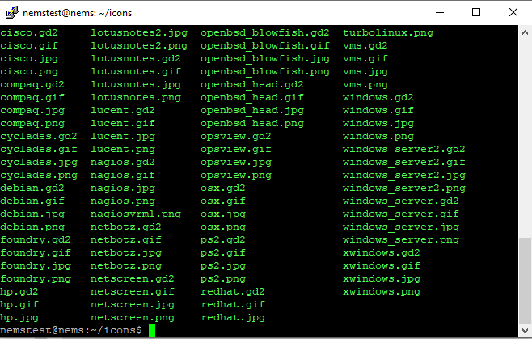
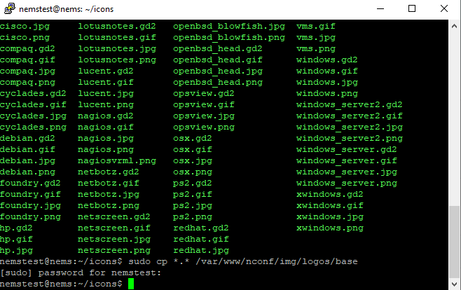
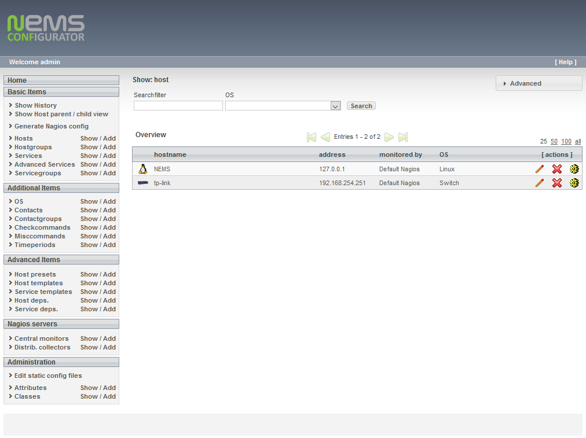
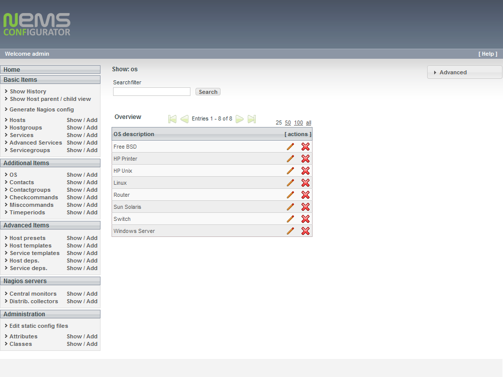
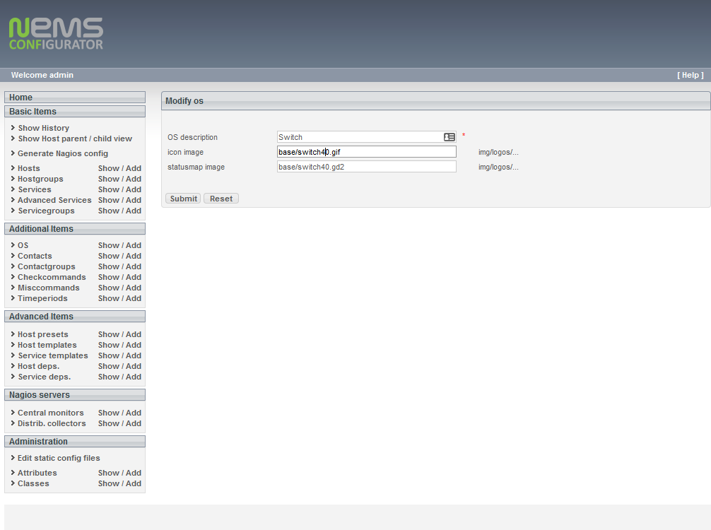
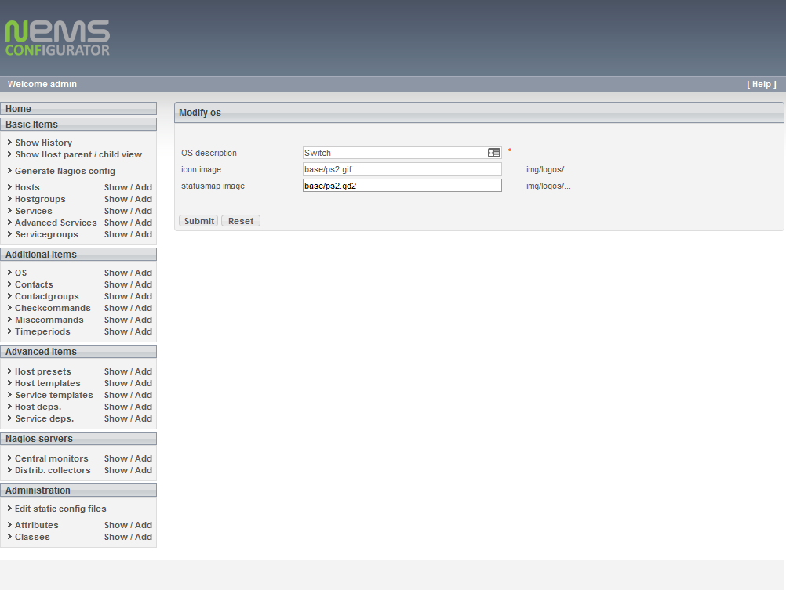
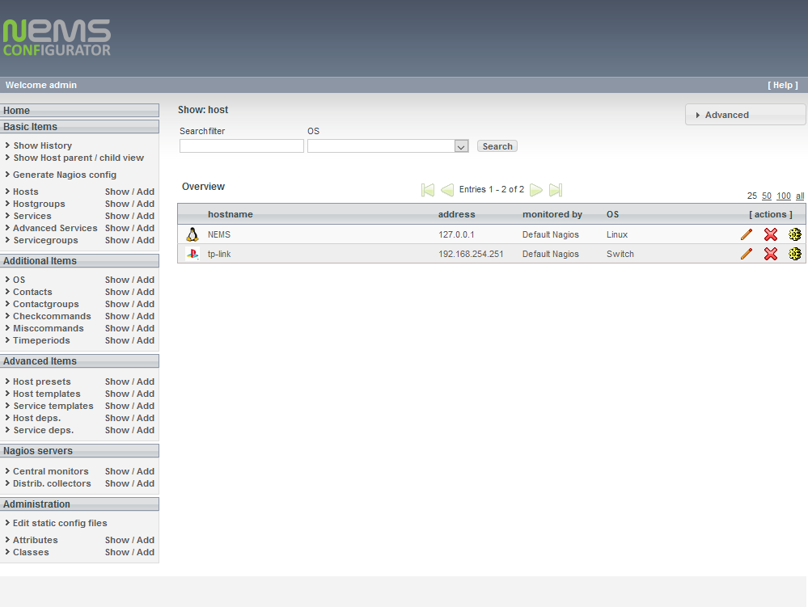

Copying OS icons to NEMS
========================
To add additional or custom OS icons to NEMS, perform the following:

From a file browser window, open the Home share on the NEMS server (i.e. \\nems_ip\Home) and log in with your NEMS credentials.

Create a folder.  In this example, it is "icons"

  
Start an SSH session to the NEMS server and login.  The "icons" folder is displayed when ls is ran.
Copy the icon images into this new folder.

"cd" into the "icons" folder and run ls to verify the icon files are there.
Copy the icon images into this new folder.

The icon file can be copied or moved into the /var/www/nconf/img/logos/base folder.
-To copy "sudo cp *.* /var/www/nconf/img/logos/base"
-To move "sudo mv *.* /var/www/nconf/img/logos/base"

Login the nconf for NEMS.
In this example, the icon for "switch" will be changed.

Click on Show for OS, then click on edit (pencil icon) for the OS to be modified.

Edit the gif name to the new icon name and click submit.

Go back to Hosts and verify the icon has changed.

Nagios icon packs
https://exchange.nagios.org/directory/Graphics-and-Logos/Images-and-Logos
